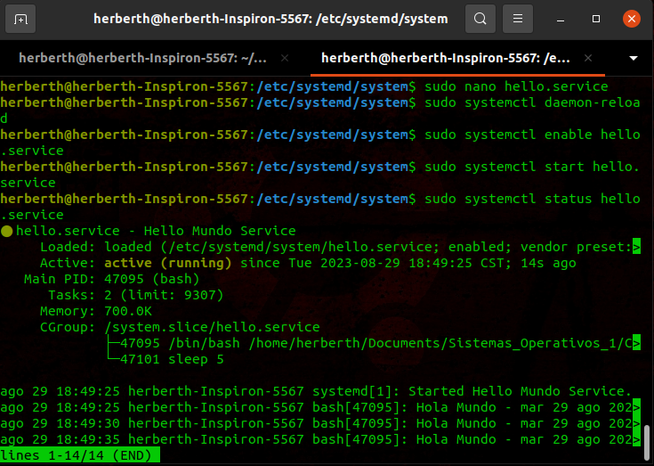
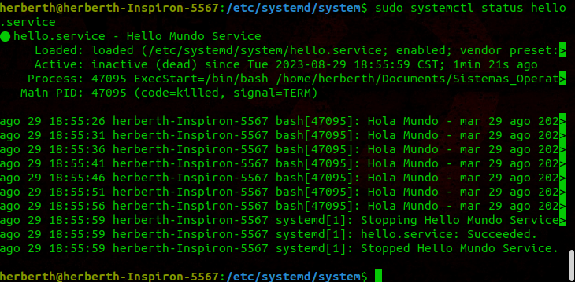

### Instalación y uso de un Servicio en sistemas basados en Debian/Ubuntu

1. Crea el script que el servicio va a ejecutar en una ubicación de tu elección. En este caso se nombro "hello_script.sh":

   ```bash
   #!/bin/bash
   while true; do
     echo "Hola Mundo - $(date)"
     sleep 5
   donde

2. Asegúrate de que el hello_script.sh  tenga permisos de ejecución. Si no los tiene, puedes darle permisos utilizando el siguiente comando (reemplaza '/ruta/a/tu_script.sh' con la ubicación  real de tu script):

   ```bash
   chmod +x /ruta/a/tu_script.sh

### Instalación y Uso del Servicio "Hello"

3. Abre una terminal en tu sistema. Crea el archivo de servicio "hello.service" en la ruta "/etc/systemd/system/" utilizando el siguiente comando:

   ```bash
   :/etc/systemd/system$ sudo nano /etc/systemd/system/hello.service

4. Copia y pega el siguiente contenido en el archivo "hello.service":

   ```plaintext
   [Unit]
   Description=Hello Script Service
   After=network.target

   [Service]
   User=<USUARIO_DE_TU_MAQUINA>
   ExecStart=/bin/bash /home/<TU_RUTA>/hello_script.sh
   Restart=always

   [Install]
   WantedBy=default.target

5. Guarda el archivo y cierra el editor:

### Recargar la Configuración de Systemd

6. Recarga la configuración de los servicios de systemd para que reconozca el nuevo servicio:

   ```bash
   :/etc/systemd/system$ sudo systemctl daemon-reload

### Habilitar y Ejecutar el Servicio

7. Habilitael servicio para que se inicio automáticamente al arrancar el sistema:

   ```bash
   :/etc/systemd/system$ sudo systemctl enable hello.service

8. Inicia el servicio:

   ```bash
   :/etc/systemd/system$ sudo systemctl start hello.service



### Verificar el Estado del Servicio

9. Verifica el estado del servicio para asegurarte de que se este ejecutando:

    ```bash
    :/etc/systemd/system$ sudo systemctl status hello.service

El servicio "Hello" debería ejecutar el script "hello_script.sh" cada cierto tiempo.

### Detener el Servicio

10. Detén el servicio usando el comando "systemctl" seguido de "stop" y el nombre del servicio:

    ```bash
    :/etc/systemd/system$ sudo systemctl stop hello.service



11. Si deseas deshabilitar el servicio para que no se inicie automáticamente en el arranque del sistema:

    ```bash
    :/etc/systemd/system$ sudo systemctl disable hello.service

12. Si en algún momento se desea eliminar completamente el servicio, puedes eliminar el archivo del servicio y luego recargar la configuración de systemd con:

    ```bash
    :/etc/systemd/system$ sudo systemctl daemon-reload

### Operaciones comunes que se pueden realizar con Systemd

  - Iniciar un servicio:
    ```javascript
    systemctl start nombre_del_servicio.service

  - Detener un servicio:
    ```javascript
    systemctl stop nombre_del_servicio.service

  - Reiniciar un servicio:
    ```javascript
    systemctl restart nombre_del_servicio.service

  - Habilitar un servicio para que se inicie en el arranque:
    ```javascript
    systemctl enable nombre_del_servicio.service

  - Deshabilitar un servicio para que no se inicie en el arranque:
    ```javascript
    systemctl disable nombre_del_servicio.service

  - Ver el estado de un servicio:
    ```javascript
    systemctl status nombre_del_servicio.service

  - Ver el registro de un servicio:
    ```javascript
    journalctl -u nombre_del_servicio.service
